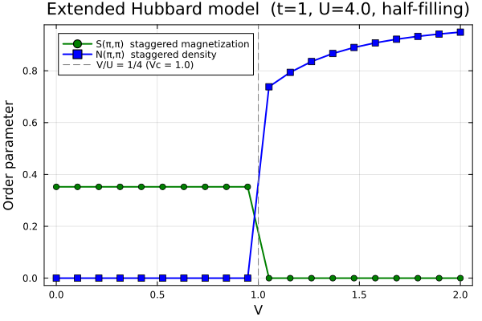

# MeanFieldTheories.jl

**MeanFieldTheories.jl** is a Julia package for studying quantum many-body systems using mean-field theory and related methods. It provides a complete workflow from constructing many-body Hamiltonians to obtaining self-consistent ground states and calculating collective excitation spectra, covering methods such as Hartree-Fock (HF), Single-Mode Approximation (SMA) and Random Phase Approximation (RPA).

See documents: https://Quantum-Many-Body.github.io/MeanFieldTheories.jl

## Features

- **Fully customizable quantum system** Degrees of freedom (site, sublattice, spin, orbital, valley, …) are freely defined by the user via `SystemDofs`, with user-specified constraints.

-  **High flexibility for generating operator representations** DOF index constraints can be applied directly to `generate_onebody` and `generate_twobody` to select only the desired terms on each bond. 

-  **Highly free forms of interaction** Two-body interaction allows four different site index $(i,j,k,l)$. The creation-annihilation ordering of the operator string is also arbitrary and handled automatically.

- **Unrestricted Hartree-Fock in both real and momentum space.** All four Wick contraction channels (Hartree and Fock, both pairs) are kept open with no preset symmetry breaking.

- **Complete post-HF excitation spectrum.** On top of the mean-field ground state, collective modes are accessible via Single-Mode Approximation (SMA) and Random Phase Approximation (RPA), yielding dynamic structure factors and excitation gaps directly.

## Installation

```julia
using Pkg
Pkg.develop(url="https://github.com/Quantum-Many-Body/MeanFieldTheories.jl")
```

## Quick Start

### Real-Space Hartree-Fock Approximation (`solve_hfr`)

Hubbard model ($t=1$, $U=4$, half-filling on a 4×4 square lattice) solved by real-space Hartree-Fock. 

```julia
using MeanFieldTheories

# Square lattice with periodic boundary conditions
unitcell = Lattice([Dof(:site, 1)], [QN(site=1)], [[0.0, 0.0]])
lattice  = Lattice(unitcell, [[1.0, 0.0], [0.0, 1.0]], (4, 4))
t = 1.0;  U = 4.0

# Operators (shared by all four cases below)
function make_ops(dofs)
    t_ops = generate_onebody(dofs, bonds(lattice, (:p, :p), 1),
        (delta, qn1, qn2) -> qn1.spin == qn2.spin ? -t : 0.0).ops
    U_ops = generate_twobody(dofs, bonds(lattice, (:p, :p), 0),
        (deltas, qn1, qn2, qn3, qn4) ->
            (qn1.spin, qn2.spin, qn3.spin, qn4.spin) == (1, 1, 2, 2) ? U : 0.0,
        order = (cdag, :i, c, :i, cdag, :i, c, :i)).ops
    vcat(t_ops, U_ops)
end

dofs = SystemDofs([Dof(:site, 16), Dof(:spin, 2, [:up, :down])])
result = solve_hfr(dofs, make_ops(dofs), [16])
```

Run log:
```
============================================================
Hartree-Fock SCF Solver
============================================================
[23:33:39] Building Hamiltonian  (144 operators)
               t matrix: (32, 32), nnz = 128      303.417μs
               U matrix: (1024, 1024), nnz = 64       132.084μs
  System: N = 32, blocks = 1, particles = [16] (total = 16)
  T = 0,  mixing = DIIS(m=8),  tol = 1e-08,  max_iter = 1000
============================================================
[23:33:39] G initialized   688.750μs
[23:33:39] Iter    1  res = 3.904e-03  E = -24.187702  NCond = 1.4307
[23:33:39] Iter    2  res = 3.567e-03  E = -35.726796  NCond = 16.0000
[23:33:39] Iter    3  res = 1.213e-03  E = -8.659815  NCond = 16.0000
[23:33:39] Iter    4  res = 7.604e-04  E = -10.074263  NCond = 16.0000
[23:33:39] Iter    5  res = 5.674e-04  E = -10.458854  NCond = 16.0000
[23:33:39] Iter   10  res = 1.073e-04  E = -13.080404  NCond = 16.0000
[23:33:39] Iter   20  res = 1.138e-09 < 1.000e-08  CONVERGED
============================================================
[23:33:39] SCF CONVERGED  (20 iterations)
  Band energy:        -4.5074927205
  Interaction energy: -8.0590628824
  Total energy:       -12.5665556029
  NCond:              16.000000
  Sz:                 +0.000001
  μ (block 1):       +1.9999999892

  ── Timing Summary ────────────────────────────────────────────
  Phase                      Total         Avg   Calls
  ────────────────────────────────────────────────────────
  build_T                303.417μs   303.417μs       1
  build_U                132.084μs   132.084μs       1
  initialize_green       688.750μs   688.750μs       1
  build_h_eff            150.002μs     7.500μs      20
  diagonalize              6.580ms   329.012μs      20
  update_green           395.210μs    19.760μs      20
  calc_energies          234.918μs    12.364μs      19
  ────────────────────────────────────────────────────────
  solve_hfr (total)       15.241ms    15.241ms       1
  ────────────────────────────────────────────────────────
```
### Momentum-Space Hartree-Fock Approximation (`solve_hfk`)

t-V model ($$t=1$$, $$V=4$$ on  a 4×4 square lattice) solved by momentum-space Hartree-Fock. 

```julia
using MeanFieldTheories

dofs = SystemDofs([Dof(:site, 4), Dof(:spin, 2, [:up, :dn])])

unitcell = Lattice([Dof(:site, 4)],
                     [QN(site=1), QN(site=2), QN(site=3), QN(site=4)],
                     [[0.0, 0.0], [1.0, 0.0], [0.0, 1.0], [1.0, 1.0]];
                     supercell_vectors=[[2.0, 0.0], [0.0, 2.0]])

nn_bonds = bonds(unitcell, (:p, :p), 1)

onebody = generate_onebody(dofs, nn_bonds,
    (delta, qn1, qn2) -> qn1.spin == qn2.spin ? -1.0 : 0.0)

# V Σ_{i≠j, σσ'} n_{iσ} n_{jσ'} 
twobody = generate_twobody(dofs, nn_bonds,
    (deltas, qn1, qn2, qn3, qn4) ->
        qn1.spin == qn2.spin && qn3.spin == qn4.spin ? 4.0 : 0.0)

ks = build_kpoints([[2.0, 0.0], [0.0, 2.0]], (2, 2))

result = solve_hfk(dofs, onebody, twobody, ks, 16)
```

Run log:
```
============================================================
Hartree-Fock SCF Solver (momentum space)
============================================================
  Nk = 4,  d = 8,  n_electrons = 16,  T = 0
  mixing = DIIS(m=8),  tol = 1e-08,  max_iter = 1000
============================================================
[23:25:44]  T(r): 6 terms   357.584μs
[23:25:44]  V(r): 5 triples   557.208μs
[23:25:44] G initialized    39.417μs
[23:25:44] Iter    1  res = 1.563e-02  E = -6.193238  NCond = 4.0000
[23:25:44] Iter   10  res = 3.392e-09 < 1.000e-08  CONVERGED
============================================================
[23:25:44] SCF CONVERGED  (10 iterations)
  Band energy:        -0.0095358050
  Interaction energy: -0.5570200781
  Total energy:       -0.5665558830
  NCond:              4.000000
  μ:                  +16.0000000000

  ── Timing Summary (k-space HF) ───────────────────────────
  Phase                        Total         Avg   Calls
  ──────────────────────────────────────────────────────────
  build_Tr                 357.584μs   357.584μs       1
  build_Tk                   7.625μs     7.625μs       1
  build_Vr                 557.208μs   557.208μs       1
  initialize_green_k        39.417μs    39.417μs       1
  build_heff_k               4.792ms   479.237μs      10
  diagonalize_k              4.512ms   451.200μs      10
  update_green_k           643.875μs    64.387μs      10
  calc_energies_k           56.251μs    28.125μs       2
  ──────────────────────────────────────────────────────────
  solve_hfk (total)         18.799ms    18.799ms       1
  ──────────────────────────────────────────────────────────
```

## Benchmark

### CDW-SDW Phase Diagram of Extended Hubbard Model

This benchmark reproduces the phase diagram of the extended Hubbard model on a 2D square lattice at half-filling:

$$H = -t \sum_{\langle ij \rangle,\sigma} c^\dagger_{i\sigma}c_{j\sigma} + U \sum_i n_{i\uparrow}n_{i\downarrow} + V \sum_{\langle ij \rangle} n_i n_j$$

The model parameters are $t=1$, $U=4$, with nearest-neighbor repulsion $V \in [0, 2]$. At half-filling, the system exhibits two distinct phases:
- **SDW/AFM phase** ($V/U \lesssim 1/4$): antiferromagnetic order with staggered magnetization $S(\pi,\pi) \neq 0$
- **CDW/CO phase** ($V/U \gtrsim 1/4$): charge density wave order with staggered charge density $N(\pi,\pi) \neq 0$

The calculation uses momentum-space unrestricted Hartree-Fock on a $2\times2$ magnetic unit cell with a $2\times2$ $k$-grid (4 $k$-points). For each $V$, SCF is initialized from two biased initial conditions (SDW and CDW), and the lower-energy converged state is taken as the ground state.

Run:
```
julia --project=benchmark benchmark/CDW_SDW/run.jl
```

Results:



The calculated phase boundary at $V_c = U/4 = 1.0$ and the order parameter curves are in complete agreement with Fig. 5(b) of Ref. [1].

### Magnon Spectrum

This benchmark will compute the magnon excitation spectrum using SMA. (See Ref. [2] for the theoretical background.)

*Coming soon — to be added.*

## References

[1] T. Aoyama, K. Yoshimi, K. Ido, Y. Motoyama, T. Kawamura, T. Misawa, T. Kato, and A. Kobayashi, [H-wave – A Python package for the Hartree-Fock approximation and the random phase approximation](https://doi.org/10.1016/j.cpc.2024.109087), Computer Physics Communications 298, 109087 (2024).

[2] W.-X. Qiu and F. Wu, [Topological magnons and domain walls in twisted bilayer MoTe2](https://link.aps.org/doi/10.1103/sl5k-c825), Phys. Rev. B 112, 085132 (2025).


## Package Structure

- **quantumsystem**: Core quantum system definitions, lattice structures, and operator algebra
- **groundstate**: Ground state calculations using Hartree-Fock and mean-field methods
- **excitations**: Excited state calculations using RPA, TDHF, and single-mode approximation

## Citation

If you use this package in your research, please cite:

```bibtex
@software{meanfieldtheories,
  author = {Yong-Yue Zong},
  title = {MeanFieldTheories.jl: A Julia package for quantum many-body systems using mean-field theory and related methods},
  year = {2026},
  url = {https://github.com/Quantum-Many-Body/MeanFieldTheories.jl}
}
```

## Contributing

Contributions are welcome! Please feel free to submit issues or pull requests on [GitHub](https://github.com/Quantum-Many-Body/MeanFieldTheories.jl).

## Contact

Yong-Yue Zong — [zongyongyue@gmail.com](mailto:zongyongyue@gmail.com)

## License

This project is licensed under the MIT License - see the LICENSE file for details.
