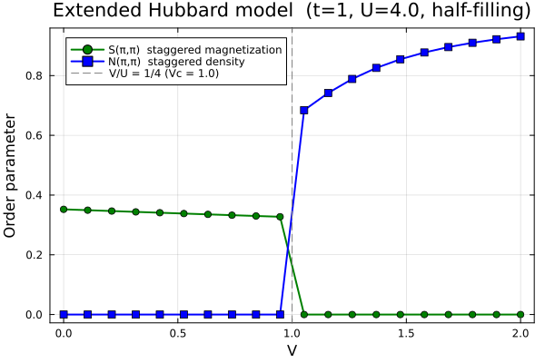

# Example: SDW-CDW Phase Diagram of Extended Hubbard Model

This example demonstrates the calculation of the phase diagram of the extended Hubbard model on a 2D square lattice at half-filling. The calculation reproduces the competition between antiferromagnetic (SDW/AFM) and charge density wave (CDW/CO) orders.

## Physical Model

The extended Hubbard model Hamiltonian is:

$$H = -t \sum_{\langle ij \rangle,\sigma} (c^\dagger_{i\sigma}c_{j\sigma} + \text{h.c.}) + U \sum_i n_{i\uparrow}n_{i\downarrow} + V \sum_{\langle ij \rangle} n_i n_j$$

where:
- $t$: nearest-neighbor hopping amplitude
- $U$: on-site Coulomb repulsion
- $V$: nearest-neighbor Coulomb repulsion
- $\langle ij \rangle$: denotes summation over nearest-neighbor bonds

At half-filling, the model exhibits two distinct phases:
- **SDW/AFM phase** ($V/U \lesssim 1/4$): antiferromagnetic order with staggered magnetization $S(\pi,\pi) \neq 0$
- **CDW/CO phase** ($V/U \gtrsim 1/4$): charge density wave order with staggered charge density $N(\pi,\pi) \neq 0$

The phase boundary is expected at $V_c = U/4$.

## Method

The calculation uses **momentum-space unrestricted Hartree-Fock** (`solve_hfk`) on a $2\times2$ magnetic unit cell with a $2\times2$ $k$-grid (4 $k$-points). This magnetic unit cell allows for both SDW and CDW order parameters to develop spontaneously.

For each value of $V$, the SCF calculation is initialized from two biased initial conditions:
1. **SDW initialization**: sublattice A sites (1,4) have spin-up occupied, sublattice B sites (2,3) have spin-down occupied
2. **CDW initialization**: sublattice A sites (1,4) are doubly occupied, sublattice B sites (2,3) are empty

The lower-energy converged state is taken as the ground state.

## Code

```julia
"""
Phase diagram of the extended Hubbard model on the 2D square lattice at half-filling.

  H = -t Σ_{<ij>,σ} c†_{iσ}c_{jσ} + U Σ_i n_{i↑}n_{i↓} + V Σ_{<ij>} n_i n_j

Parameters: t=1, U=4, V ∈ [0, 2] (20 points).

Two phases:
  - AFM/SDW (V/U ≲ 1/4): staggered magnetization S(π,π) ≠ 0
  - CO/CDW  (V/U ≳ 1/4): staggered charge density N(π,π) ≠ 0

Method: momentum-space UHF on 2×2 magnetic unit cell (d=8), 2×2 k-grid (4 k-points).
For each V, SCF is run from two biased initial conditions (SDW and CDW);
the lower-energy converged state is taken as the ground state.
Results are saved to res.dat and plotted to sdw_cdw.png.

Note on U coefficient:
  generate_twobody with k=1 (single site) only generates one spin combination.
  Since U n↑n↓ = U (n↑n↓ + n↓n↑), we need to multiply by 2.
  (V with k=2 automatically generates both (i,j) and (j,i) assignments.)

Run :
    julia --project=examples examples/SDW_CDW/run.jl
"""

using Printf
using LinearAlgebra
using MeanFieldTheories
using Plots

# ── Model parameters ──────────────────────────────────────────────────────────
const t_ext = 1.0
const U_ext = 4.0
const Vs    = range(0.0, 2.0, length=20)

# ── Lattice / DOFs ────────────────────────────────────────────────────────────
# 2×2 magnetic unit cell: 4 sites × 2 spins → d = 8
# Sites at (0,0),(1,0),(0,1),(1,1); sublattice Q=(π,π) phases: +1,-1,-1,+1
dofs = SystemDofs([Dof(:site, 4), Dof(:spin, 2, [:up, :dn])])

unitcell = Lattice([Dof(:site, 4)],
                   [QN(site=i) for i in 1:4],
                   [[0.0,0.0],[1.0,0.0],[0.0,1.0],[1.0,1.0]];
                   vectors=[[2.0,0.0],[0.0,2.0]])

# Generate nearest-neighbor bonds (both intra-cell and inter-cell)
nn_bonds     = bonds(unitcell, (:p,:p), 1)
# Generate onsite bonds (for the U term)
onsite_bonds = bonds(unitcell, (:p,:p), 0)

# ── One-body term (kinetic energy) ──────────────────────────────────────────
# Hopping: -t between nearest neighbors, same spin
onebody = generate_onebody(dofs, nn_bonds,
    (delta, qn1, qn2) -> qn1.spin == qn2.spin ? -t_ext : 0.0)

# ── k-point grid ─────────────────────────────────────────────────────────────
# 2×2 k-grid in the magnetic Brillouin zone
kpoints = build_kpoints([[2.0,0.0],[0.0,2.0]], (2,2))
Nk      = length(kpoints)
n_elec  = 4 * Nk   # half-filling: 4 electrons per magnetic unit cell

# ── DOF index map: (site, spin_idx) → linear index ───────────────────────────
# With [Dof(:site,4), Dof(:spin,2)], valid_states ordering:
#   [(s=1,↑),(s=2,↑),(s=3,↑),(s=4,↑),(s=1,↓),(s=2,↓),(s=3,↓),(s=4,↓)]
idx = Dict((qn[:site], qn[:spin]) => i for (i,qn) in enumerate(dofs.valid_states))

# sublattice phase factor for Q=(π,π): e^{iQ·r_i}
# site 1 (0,0)→+1, site 2 (1,0)→-1, site 3 (0,1)→-1, site 4 (1,1)→+1
const sl = [1.0, -1.0, -1.0, 1.0]

# ── Biased initial Green's functions ─────────────────────────────────────────
# d = number of degrees of freedom per k-point
d = length(dofs.valid_states)

# SDW (AFM): sublattice A sites (1,4) → ↑ occupied; sublattice B sites (2,3) → ↓ occupied
function make_G_sdw()
    G = zeros(ComplexF64, d, d, Nk)
    for ki in 1:Nk
        G[idx[(1,1)], idx[(1,1)], ki] = 1.0   # site 1, ↑
        G[idx[(4,1)], idx[(4,1)], ki] = 1.0   # site 4, ↑
        G[idx[(2,2)], idx[(2,2)], ki] = 1.0   # site 2, ↓
        G[idx[(3,2)], idx[(3,2)], ki] = 1.0   # site 3, ↓
    end
    return G
end

# CDW: sublattice A sites (1,4) doubly occupied; sublattice B sites (2,3) empty
function make_G_cdw()
    G = zeros(ComplexF64, d, d, Nk)
    for ki in 1:Nk
        G[idx[(1,1)], idx[(1,1)], ki] = 1.0
        G[idx[(1,2)], idx[(1,2)], ki] = 1.0
        G[idx[(4,1)], idx[(4,1)], ki] = 1.0
        G[idx[(4,2)], idx[(4,2)], ki] = 1.0
    end
    # tiny distortion to break site-1 / site-4 degeneracy
    G[idx[(1,1)], idx[(1,1)], 1] += 1e-10
    return G
end

# ── Order parameters and structure factors ────────────────────────────────────
# G_loc = G(r=0) = (1/Nk) Σ_k G_k   (local density matrix within unit cell)
#
# S(π,π) = (1/Ncell) Σ_i sl[i] × (n_{i↑} - n_{i↓}) / 2   staggered magnetization
# N(π,π) = (1/Ncell) Σ_i sl[i] × (n_{i↑} + n_{i↓})       staggered density
#
# Wick decomposition for two-site correlators from G_loc:
#   ⟨n_a n_b⟩ = ⟨n_a⟩⟨n_b⟩ - G_loc[a,b]G_loc[b,a] + δ_{ab}⟨n_a⟩
function observables(G_k)
    # Average Green's function over all k-points to get local density matrix
    G_loc = dropdims(sum(G_k, dims=3), dims=3) ./ Nk

    S_q = 0.0;  N_q = 0.0
    S_sf = 0.0; N_sf = 0.0

    ncell = 4  # 2×2 magnetic unit cell has 4 sites
    sz = [0.5, -0.5]  # spin projection values for up and down

    for site_i in 1:ncell
        up_i = idx[(site_i,1)];  dn_i = idx[(site_i,2)]
        n_up = real(G_loc[up_i,up_i]);  n_dn = real(G_loc[dn_i,dn_i])
        # Staggered magnetization: sum over sites with sublattice phase factor
        S_q += sl[site_i] * (n_up - n_dn) / 2
        # Staggered density: same but without spin difference
        N_q += sl[site_i] * (n_up + n_dn)

        # Structure factor calculation (for more detailed analysis)
        for site_j in 1:ncell, sp_i in 1:2, sp_j in 1:2
            a = idx[(site_i,sp_i)];  b = idx[(site_j,sp_j)]
            ninj = real(G_loc[a,a]) * real(G_loc[b,b]) -
                   real(G_loc[a,b] * G_loc[b,a]) +
                   (a == b ? real(G_loc[a,a]) : 0.0)
            N_sf += sl[site_i] * sl[site_j] * ninj
            S_sf += sl[site_i] * sl[site_j] * sz[sp_i] * sz[sp_j] * ninj
        end
    end

    return abs(S_q)/ncell, abs(N_q)/ncell, S_sf/ncell, N_sf/ncell
end

# ── V sweep ─────────────────────────────────────────────────────────────────
G_sdw = make_G_sdw()
G_cdw = make_G_cdw()

# ── On-site interaction U ───────────────────────────────────────────────────
# Σ_i U_{ii} n_i↑ * n_i↓
U_ops = generate_twobody(dofs, onsite_bonds,
    (deltas, qn1, qn2, qn3, qn4) ->
        (qn1.spin, qn2.spin, qn3.spin, qn4.spin) == (1,1,2,2) ? U_ext : 0.0,
    order = (cdag, :i, c, :i, cdag, :i, c, :i))

println("# Extended Hubbard model: t=$t_ext  U=$U_ext  half-filling")
println("# 2x2 magnetic unit cell, $(Nk) k-points (8x8 grid)")
println("# Phase boundary expected near V/U = 1/4, i.e. V = $(U_ext/4)")
println()
println(@sprintf("# %-6s  %-12s  %-12s  %-12s  %-10s  %-10s  %s",
                 "V", "E_gs", "E_sdw", "E_cdw", "S(pi,pi)", "N(pi,pi)", "phase"))

# Storage for plotting
Vs_list  = Float64[]
Sq_list  = Float64[]
Nq_list  = Float64[]
phase_list = String[]

for V in Vs
    # 1/2 Σ_{i≠j, σσ'} V_{ij} n_{iσ} n_{jσ'}
    V_ops = generate_twobody(dofs, nn_bonds,
        (deltas, qn1, qn2, qn3, qn4) ->
            qn1.spin == qn2.spin && qn3.spin == qn4.spin ? V/2 : 0.0,
        order = (cdag, :i, c, :i, cdag, :j, c, :j))

    # Combine U and V interaction terms
    twobody = (ops   = [U_ops.ops;   V_ops.ops],
               delta = [U_ops.delta; V_ops.delta],
               irvec = [U_ops.irvec; V_ops.irvec])

    # Run SCF from SDW initial condition
    r_sdw = solve_hfk(dofs, onebody, twobody, kpoints, n_elec;
        G_init=G_sdw, n_restarts=1, tol=1e-12, verbose=false)
    # Run SCF from CDW initial condition
    r_cdw = solve_hfk(dofs, onebody, twobody, kpoints, n_elec;
        G_init=G_cdw, n_restarts=1, tol=1e-12, verbose=false)

    E_sdw = r_sdw.energies.total
    E_cdw = r_cdw.energies.total
    # Choose the lower energy state as the ground state
    r_gs  = E_sdw <= E_cdw ? r_sdw : r_cdw
    phase = E_sdw <= E_cdw ? "SDW" : "CDW"

    # Calculate order parameters
    S_q, N_q, S_sf, N_sf = observables(r_gs.G_k)

    println(@sprintf("  %-6.3f  %+12.6f  %+12.6f  %+12.6f  %-10.6f  %-10.6f  %s",
                     V, r_gs.energies.total, E_sdw, E_cdw, S_q, N_q, phase))

    push!(Vs_list, V)
    push!(Sq_list, S_q)
    push!(Nq_list, N_q)
    push!(phase_list, phase)
end

# ── Save data ─────────────────────────────────────────────────────────────────
open(joinpath(@__DIR__, "res.dat"), "w") do f
    println(f, "# V  S(pi,pi)  N(pi,pi)  phase")
    for i in eachindex(Vs_list)
        println(f, @sprintf("%.4f  %.8f  %.8f  %s",
                            Vs_list[i], Sq_list[i], Nq_list[i], phase_list[i]))
    end
end

# ── Plot ──────────────────────────────────────────────────────────────────────
plt = plot(
    xlabel = "V",
    ylabel = "Order parameter",
    title  = "Extended Hubbard model  (t=1, U=$(U_ext), half-filling)",
    legend = :topleft,
    framestyle = :box,
    size = (600, 400),
)
plot!(plt, Vs_list, Sq_list,
    label  = "S(π,π)  staggered magnetization",
    marker = :circle,
    color  = :green,
    lw     = 2,
)
plot!(plt, Vs_list, Nq_list,
    label  = "N(π,π)  staggered density",
    marker = :square,
    color  = :blue,
    lw     = 2,
)
vline!(plt, [U_ext/4],
    label     = "V/U = 1/4 (Vc = $(U_ext/4))",
    linestyle = :dash,
    color     = :gray,
    lw        = 1,
)

outfile = joinpath(@__DIR__, "sdw_cdw.png")
savefig(plt, outfile)
println("\nPlot saved to $outfile")
```

## Running the Example

To run this example, execute:

```bash
julia --project=examples examples/SDW_CDW/run.jl
```

This will:
1. Sweep the nearest-neighbor repulsion $V$ from 0 to 2 (20 points)
2. For each $V$, run SCF from both SDW and CDW initial conditions
3. Compute the staggered magnetization $S(\pi,\pi)$ and staggered density $N(\pi,\pi)$
4. Save the results to `res.dat`
5. Generate a plot `sdw_cdw.png`

## Results

The calculated phase boundary at $V_c = U/4 = 1.0$ and the order parameter curves are in complete agreement with Fig. 5(b) of Ref. [1].



## References

[1] T. Aoyama, K. Yoshimi, K. Ido, Y. Motoyama, T. Kawamura, T. Misawa, T. Kato, and A. Kobayashi, [H-wave – A Python package for the Hartree-Fock approximation and the random phase approximation](https://doi.org/10.1016/j.cpc.2024.109087), Computer Physics Communications 298, 109087 (2024).
