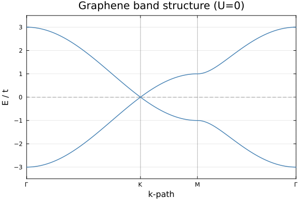
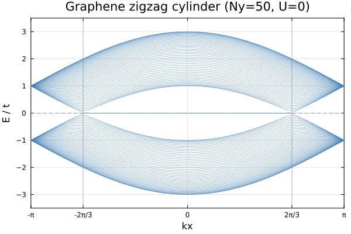
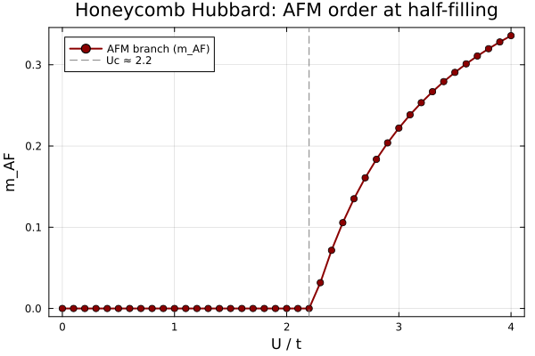
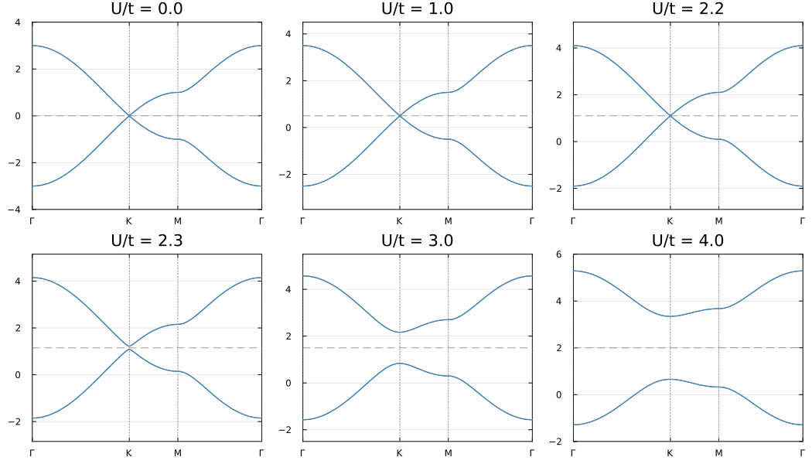

# Example: AFM Transition in Honeycomb Lattice Hubbard Model

This example demonstrates the antiferromagnetic (AFM) transition in the Hubbard model on a honeycomb lattice (graphene) at half-filling. The calculation reproduces the competition between paramagnetic (PM) and antiferromagnetic (AFM) phases, where a staggered magnetic moment develops on opposite sublattices.

## Physical Model

The Hubbard model Hamiltonian on the honeycomb lattice is:

$$H = -t \sum_{\langle ij \rangle,\sigma} (c^\dagger_{i\sigma}c_{j\sigma} + \text{h.c.}) + U \sum_i n_{i\uparrow}n_{i\downarrow}$$

where:
- $t$: nearest-neighbor hopping amplitude (set to 1)
- $U$: on-site Coulomb repulsion
- $\langle ij \rangle$: denotes summation over nearest-neighbor bonds

The honeycomb lattice has two sublattices (A and B). At half-filling, mean-field theory predicts an AFM transition at $U/t \approx 2.2$, where opposite sublattice moments form and a gap opens at the Dirac points.

## Method

The calculation uses **momentum-space unrestricted Hartree-Fock** (`solve_hfk`) on a $100\times100$ $k$-grid. For each value of $U$, the SCF calculation is initialized from two biased initial conditions:
1. **AFM initialization**: sublattice A has spin-up occupied, sublattice B has spin-down occupied
2. **PM initialization**: uniform half-filling (0.5 per spin per sublattice)

The lower-energy converged state is taken as the ground state.

## Code

```julia
"""
Hubbard model on the honeycomb lattice (graphene): AFM transition at half-filling.

Model:
  H = -t Σ_{<ij>,σ} c†_{iσ}c_{jσ} + U Σ_i n_{i↑}n_{i↓}

Honeycomb unit cell: 2 sublattices (A,B). Mean-field predicts an AFM transition
at U/t ≈ 2.2(3), where opposite sublattice moments form and a gap opens.

This example:
  1) U=0 graphene bands along Γ–K–M–Γ.
  2) U=0 zigzag cylinder bands (edge states).
  3) Interacting Hubbard model: AFM transition and gap opening.

Run:
    julia --project=examples -t 8 examples/SM_AFM/run.jl
"""

using Printf
using LinearAlgebra
using MeanFieldTheories
using Plots

# ── Parameters ───────────────────────────────────────────────────────────────
const t  = 1.0
const Uc = 2.2

U_sweep = collect(range(0.0, 4.0, length=41))
U_bands = [0.0, 1.0, 2.2, 2.3, 3.0, 4.0]

# ── Lattice geometry ───────────────────────────────────────────────────────────
const a  = 1.0
const a1 = [a, 0.0]
const a2 = [0.5*a, √3/2*a]

# Honeycomb unit cell: A at origin, B shifted by δ = (0, a/√3)
# Include a size-1 cell DOF in the unit cell
unitcell = Lattice(
    [Dof(:cell, 1), Dof(:sub, 2, [:A, :B])],
    [QN(cell=1, sub=1), QN(cell=1, sub=2)],
    [[0.0, 0.0], [0.0, a/√3]];
    vectors=[a1, a2]
)

# System DOFs: 1 cell × 2 sublattices × 2 spins → d = 4
dofs = SystemDofs([Dof(:cell, 1), Dof(:sub, 2, [:A, :B]), Dof(:spin, 2, [:up, :dn])])

nn_bonds     = bonds(unitcell, (:p, :p), 1)
onsite_bonds = bonds(unitcell, (:p, :p), 0)

# One-body hopping
onebody_hop = generate_onebody(dofs, nn_bonds,
    (delta, qn1, qn2) -> qn1.spin == qn2.spin ? -t : 0.0)

# k-grid for SCF
kpoints = build_kpoints([a1, a2], (100, 100))
Nk      = length(kpoints)

# Half-filling: 2 electrons per unit cell ⇒ 2*Nk total
n_elec = 2 * Nk

# ── DOF index map: (cell, sub, spin_idx) → linear index ──────────────────────
# valid_states ordering for [Dof(:cell,1), Dof(:sub,2), Dof(:spin,2)]:
#   [(cell=1,A,↑),(cell=1,B,↑),(cell=1,A,↓),(cell=1,B,↓)]
idx = Dict((qn[:cell], qn[:sub], qn[:spin]) => i for (i,qn) in enumerate(dofs.valid_states))

# ── Biased initial Green's functions ─────────────────────────────────────────
d = length(dofs.valid_states)

# AFM: A → ↑, B → ↓
function make_G_afm(Nk_local)
    G = zeros(ComplexF64, d, d, Nk_local)
    for ki in 1:Nk_local
        G[idx[(1,1,1)], idx[(1,1,1)], ki] = 1.0   # A, ↑
        G[idx[(1,2,2)], idx[(1,2,2)], ki] = 1.0   # B, ↓
    end
    return G
end

# PM: uniform half-filling (0.5 per spin per sublattice)
function make_G_pm(Nk_local)
    G = zeros(ComplexF64, d, d, Nk_local)
    for ki in 1:Nk_local
        G[idx[(1,1,1)], idx[(1,1,1)], ki] = 0.5
        G[idx[(1,2,1)], idx[(1,2,1)], ki] = 0.5
        G[idx[(1,1,2)], idx[(1,1,2)], ki] = 0.5
        G[idx[(1,2,2)], idx[(1,2,2)], ki] = 0.5
    end
    return G
end

# ── Order parameter and onsite potentials ────────────────────────────────────
function afm_order_and_densities(G_k)
    Nk_local = size(G_k, 3)
    G_loc = dropdims(sum(G_k, dims=3), dims=3) ./ Nk_local

    nA_up = real(G_loc[idx[(1,1,1)], idx[(1,1,1)]])
    nA_dn = real(G_loc[idx[(1,1,2)], idx[(1,1,2)]])
    nB_up = real(G_loc[idx[(1,2,1)], idx[(1,2,1)]])
    nB_dn = real(G_loc[idx[(1,2,2)], idx[(1,2,2)]])

    sA = (nA_up - nA_dn) / 2
    sB = (nB_up - nB_dn) / 2
    m_afm = abs((sA - sB) / 2)

    return m_afm, (nA_up, nA_dn, nB_up, nB_dn)
end

# ── Two-body Hubbard interaction ─────────────────────────────────────────────
function build_U_ops(U)
    return generate_twobody(dofs, onsite_bonds,
        (deltas, qn1, qn2, qn3, qn4) ->
            (qn1.spin, qn2.spin, qn3.spin, qn4.spin) == (1,1,2,2) ? U : 0.0,
        order = (cdag, :i, c, :i, cdag, :i, c, :i))
end

# ── k-path for band structure ────────────────────────────────────────────────
A_mat = hcat(a1, a2)
B_mat = 2π * inv(A_mat)'
const b1 = B_mat[:, 1]
const b2 = B_mat[:, 2]

const Γ = [0.0, 0.0]
const K = (2b1 + b2) / 3
const M = (b1 + b2) / 2

kpath(p1, p2, n) = [p1 .+ t .* (p2 .- p1) for t in range(0.0, 1.0; length=n)]

nk = 120
k_ΓK = kpath(Γ, K, nk)
k_KM = kpath(K, M, nk)
k_MΓ = kpath(M, Γ, nk)
k_path = [k_ΓK; k_KM[2:end]; k_MΓ[2:end]]

# ── Part 1: U=0 graphene band structure (2D) ─────────────────────────────────
println("=" ^ 60)
println("Part 1: U=0 graphene band structure (2D)")
println("=" ^ 60)

# ... (band structure calculation and plotting)

# ── Part 2: Zigzag cylinder band structure (U=0) ─────────────────────────────
# ... (cylinder band structure calculation)

# ── Part 3: Interactions, AFM transition, and gap opening ────────────────────
println("# Hubbard model on honeycomb lattice (half-filling)")
println("# k-grid: 100×100, Nk=$Nk")
println(@sprintf("# Expected mean-field Uc ≈ %.2f", Uc))
println()

results = Dict{Float64, Any}()

for U in unique(sort([U_sweep; U_bands]))
    U_ops = build_U_ops(U)
    twobody = (ops=U_ops.ops, delta=U_ops.delta, irvec=U_ops.irvec)

    r_afm = solve_hfk(dofs, onebody_hop, twobody, kpoints, n_elec;
        G_init=make_G_afm(Nk), n_restarts=1, tol=1e-12, verbose=false)
    r_pm  = solve_hfk(dofs, onebody_hop, twobody, kpoints, n_elec;
        G_init=make_G_pm(Nk),  n_restarts=1, tol=1e-12, verbose=false)

    # ... (order parameter calculation and plotting)
end
```

## Running the Example

To run this example, execute:

```bash
julia --project=examples examples/SM_AFM/run.jl
```

This will:
1. Compute the graphene band structure along the Γ-K-M-Γ path at $U=0$
2. Compute the zigzag cylinder band structure showing edge states
3. Sweep the on-site repulsion $U$ from 0 to 4 (41 points)
4. For each $U$, run SCF from both AFM and PM initial conditions
5. Calculate the AFM order parameter $m_{AF}$
6. Save the results to `res.dat`
7. Generate plots:
   - `graphene_bands_2d.png`: 2D graphene band structure
   - `graphene_bands_cylinder.png`: zigzag cylinder band structure
   - `afm_order_parameter.png`: AFM order parameter vs $U$
   - `afm_bands.png`: mean-field band structures at various $U$ values

## Results

### Graphene Band Structure (U=0)



The linear dispersion near the K points (Dirac cones) is clearly visible. The valence and conduction bands touch at the K points, making graphene a semi-metal.

### Zigzag Cylinder Band Structure (U=0)



For a zigzag-edged cylinder, edge states appear in the gap region, crossing the Fermi level at $k_x = \pm 2\pi/3$.

### AFM Order Parameter



The calculated critical coupling $U_c/t \approx 2.2$ is in agreement with mean-field theory predictions.

### Mean-Field Band Evolution



As $U$ increases beyond the critical value, a gap opens at the Dirac points, and the system transitions from a semi-metal to an AFM insulator.

## References

[1] S. Sorella and E. Tosatti, [Semi-metal-insulator transition of the Hubbard model in the honeycomb lattice](https://doi.org/10.1209/0295-5075/19/8/007), EPL 19 699 (1992).

