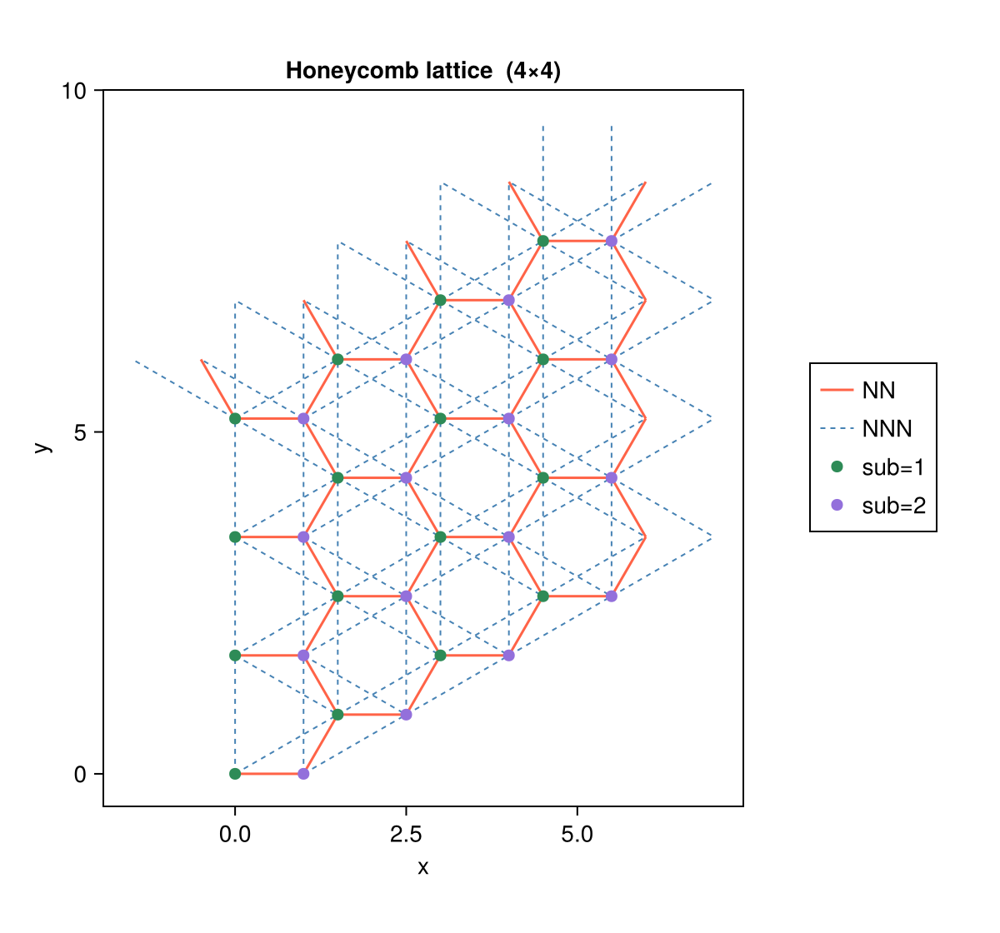
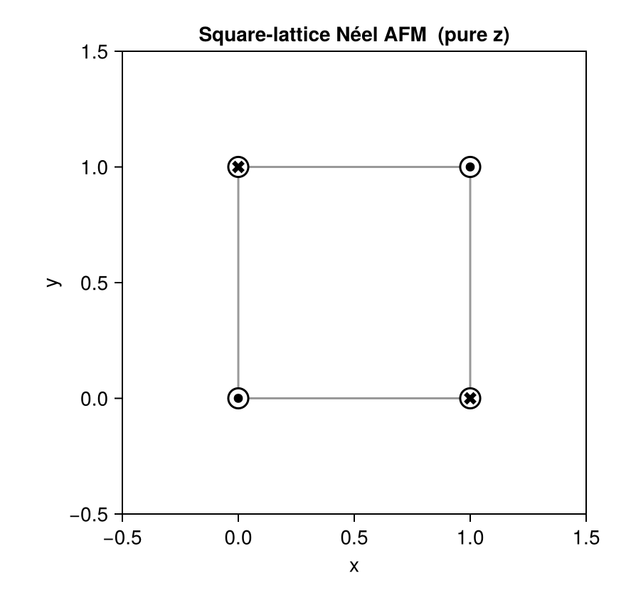
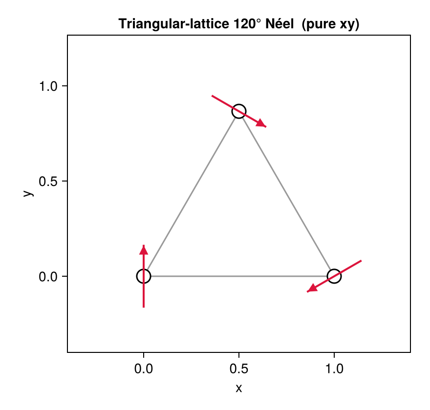
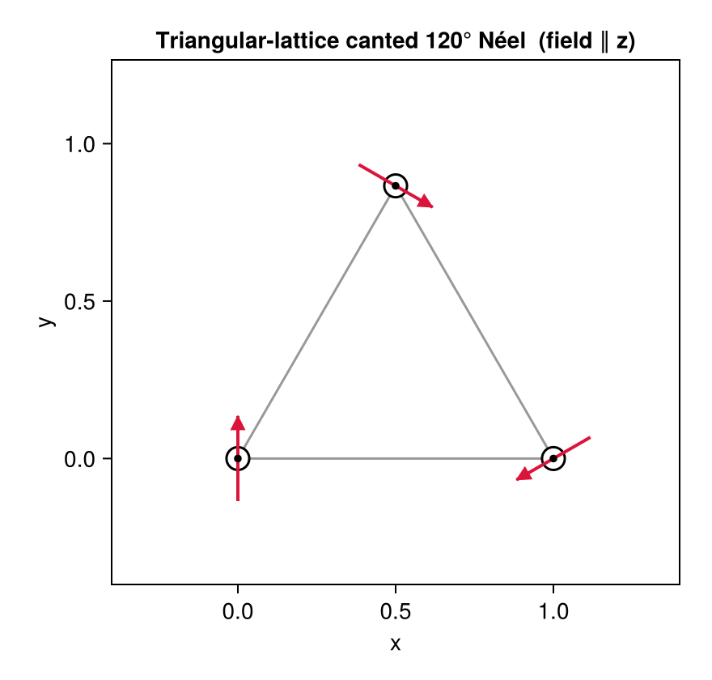

# Visualization

MeanFieldTheories.jl provides built-in visualization through a **Makie package extension**.
Load any Makie backend before calling the plot functions — no other change to your code is needed:

```julia
using CairoMakie   # save to file (PNG, PDF, SVG, …)
using GLMakie      # interactive window
using WGLMakie     # Jupyter / Pluto notebook
```

---

## Lattice Visualization

```@docs
plot_lattice
```

`plot_lattice(lattice; kwargs...)` draws a tiled lattice with any number of bond sets
and optional sublattice coloring.

### Example: Honeycomb lattice

```julia
using MeanFieldTheories
using CairoMakie

# Honeycomb primitive vectors and 2-site unit cell
const a1 = [0.0, sqrt(3.0)]
const a2 = [1.5, sqrt(3.0)/2]

unitcell = Lattice(
    [Dof(:cell, 1), Dof(:sub, 2, [:A, :B])],
    [QN(cell=1, sub=1), QN(cell=1, sub=2)],
    [[0.0, 0.0], [1.0, 0.0]];
    vectors = [a1, a2])

lattice = Lattice(unitcell, (4, 4))

nn_bonds  = bonds(lattice, (:p, :p), 1)
nnn_bonds = bonds(lattice, (:p, :p), 2)

fig = plot_lattice(lattice;
    bond_lists   = [nn_bonds, nnn_bonds],
    bond_colors  = [:tomato, :steelblue],
    bond_labels  = ["NN", "NNN"],
    bond_widths  = [1.5, 1.0],
    bond_styles  = [:solid, :dash],
    site_groupby = :sub,
    site_colors  = [:seagreen, :mediumpurple],
    title        = "Honeycomb lattice  (4×4)")

save("lattice_bonds.png", fig)
```



---

## Magnetization Visualization

```@docs
plot_magnetization
```

`plot_magnetization(mags, positions; kwargs...)` encodes the full 3D spin vector in a
single top-view panel:

| Element | Meaning |
|---------|---------|
| **Arrow** | direction = $(m_x, m_y)$; length $\propto \sqrt{m_x^2+m_y^2}$ |
| **⊙ dot** | $m_z > 0$ (spin out of page), size $\propto m_z$ |
| **⊗ cross** | $m_z < 0$ (spin into page), size $\propto |m_z|$ |

`mags` is the output of [`local_magnetization`](@ref), and `positions` is a vector of
site coordinates (e.g. `unitcell.coordinates`).  Bond pairs for the visualization
can be extracted from the package's bond infrastructure with a small helper:

```julia
function bond_pairs(bond_list, lattice)
    state_idx = Dict(s => i for (i, s) in enumerate(lattice.position_states))
    seen = Set{Tuple{Int,Int}}()
    for b in bond_list
        length(b.states) == 2 || continue
        i = get(state_idx, b.states[1], nothing)
        j = get(state_idx, b.states[2], nothing)
        (isnothing(i) || isnothing(j)) && continue
        push!(seen, (min(i, j), max(i, j)))
    end
    return sort!(collect(seen))
end
```

### Case 1 — Square lattice Néel AFM (pure z)

All spins point along ±z; only ⊙/⊗ markers appear, no arrows.

```julia
sq_uc = Lattice(
    [Dof(:site, 4)],
    [QN(site=i) for i in 1:4],
    [[0.0,0.0],[1.0,0.0],[0.0,1.0],[1.0,1.0]];
    vectors = [[2.0,0.0],[0.0,2.0]])

sq_bonds = bond_pairs(bonds(sq_uc, (:p,:p), 1), sq_uc)

mz0 = 0.45
afm_mags = [
    (label=(site=1,), n=1.0, mx=0.0, my=0.0, mz=+mz0, m=mz0, theta_deg=0.0,   phi_deg=0.0),
    (label=(site=2,), n=1.0, mx=0.0, my=0.0, mz=-mz0, m=mz0, theta_deg=180.0, phi_deg=0.0),
    (label=(site=3,), n=1.0, mx=0.0, my=0.0, mz=-mz0, m=mz0, theta_deg=180.0, phi_deg=0.0),
    (label=(site=4,), n=1.0, mx=0.0, my=0.0, mz=+mz0, m=mz0, theta_deg=0.0,   phi_deg=0.0),
]

fig = plot_magnetization(afm_mags, sq_uc.coordinates;
    title = "Square-lattice Néel AFM  (pure z)",
    bonds = sq_bonds)
save("case1_square_afm_z.png", fig)
```



### Case 2 — Triangular lattice 120° Néel order (pure in-plane)

Spins rotate by 120° per sublattice in the xy-plane; only arrows appear, no ⊙/⊗.
The magnetic unit cell is the minimal √3×√3 reconstruction (3 sites, one per sublattice).

```julia
tri_uc = Lattice(
    [Dof(:site, 3)],
    [QN(site=i) for i in 1:3],
    [[0.0, 0.0], [1.0, 0.0], [0.5, sqrt(3)/2]];
    vectors = [[3/2, sqrt(3)/2], [0.0, sqrt(3)]])

tri_bonds = bond_pairs(bonds(tri_uc, (:p,:p), 1), tri_uc)

m0 = 0.45
tri_mags = [
    (label=(site=1,), n=1.0, mx=0.0,             my=+m0,    mz=0.0, ...),  # 90°
    (label=(site=2,), n=1.0, mx=-m0*sqrt(3)/2,   my=-m0/2,  mz=0.0, ...),  # −150°
    (label=(site=3,), n=1.0, mx=+m0*sqrt(3)/2,   my=-m0/2,  mz=0.0, ...),  # −30°
]

fig = plot_magnetization(tri_mags, tri_uc.coordinates;
    title        = "Triangular-lattice 120° Néel  (pure xy)",
    bonds        = tri_bonds,
    axis_padding = 0.4)
save("case2_triangular_120neel_xy.png", fig)
```



### Case 3 — Canted 120° Néel under uniform magnetic field (all three components)

A uniform field along +z cants all spins by θ = 55° while preserving the 120° in-plane
arrangement.  Each site shows both ⊙ (uniform positive $m_z$) and an in-plane arrow.

```julia
θ_cant = 55 * π / 180
mz_c   = m0 * cos(θ_cant)
mxy_c  = m0 * sin(θ_cant)

cant_mags = [
    (label=(site=1,), n=1.0, mx=0.0,              my=+mxy_c,  mz=mz_c, ...),
    (label=(site=2,), n=1.0, mx=-mxy_c*sqrt(3)/2, my=-mxy_c/2, mz=mz_c, ...),
    (label=(site=3,), n=1.0, mx=+mxy_c*sqrt(3)/2, my=-mxy_c/2, mz=mz_c, ...),
]

fig = plot_magnetization(cant_mags, tri_uc.coordinates;
    title        = "Triangular-lattice canted 120° Néel  (field ∥ z)",
    bonds        = tri_bonds,
    axis_padding = 0.4)
save("case3_canted_120neel_xyz.png", fig)
```



!!! tip "Running the full script"
    The complete runnable script for all three cases is at
    `examples/Plot_magnetization/run.jl`.  It uses [`local_magnetization`](@ref) output
    directly from a solved HF problem rather than manually constructed NamedTuples.
